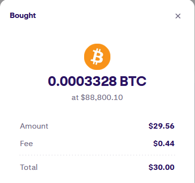
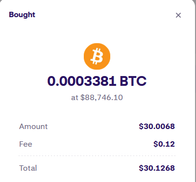

# dca

A simple DCA tool written to buy Bitcoin at market rates on Kraken.com. Written to cut down on transaction fees caused by 
Kraken's recurring fee implementation. 

**This is still a WIP - the intent is to run this process on a scheduled interval (daily)**.

### Development

This isn't made available for non-developer use. It's probably going to serve more as an example on how to interact
with the Kraken API.

To run the application you should define the following config file (see [config.example.json](config.example.json))

```json5
{
  "krakenApiKey": "...",
  "krakenPrivateKey": "...",
  "orderAmountInCents": 500
}
```

AWS resources are accessed when environment variables are prefixed with either: `awssm:` or `awsssme:` the former indicating
that the resource to be read is from AWS Systems Manager and the latter that it's an encrypted value in AWS Systems Manager. 

Example values include:

```text
awsssm:///path/to/my/value
awsssme:///path/to/my/encrypted/value
```

#### API Key permissions

In order to work with the *[Add Order](https://docs.kraken.com/api/docs/rest-api/add-order/)* API you need a key with permissions
to Create & Modify orders (located under the Orders and Trades permissions).

#### Deployment (Terraform)

##### One-time Setup

To setup the required terraform infrastructure for first deployment you'll need to run the [infra/scripts/setup.sh](./infra/scripts/setup.sh)
script. This will create an S3 bucket for you to store your state in.

You'll need to provide both an `AWS_REGION` and a `TERRAFORM_STATE_S3_BUCKET_NAME` variable.

```bash
AWS_REGION=us-east-1 TERRAFORM_STATE_S3_BUCKET_NAME=my-dca-lambda-terraform-state ./scripts/setup.sh 
```

This will result in output like the following...

```bash
Creating my-dca-lambda-terraform-state in us-east-1
{
    "Location": "/my-dca-lambda-terraform-state"
}
Enabling bucket versioning on my-dca-lambda-terraform-state
Bucket created successfully, set the tf_state_bucket variable to my-dca-lambda-terraform-state
```

The


#### Deployment

IaC is still a work in progress but for a manual deployment...

1. Create an SSM Encrypted String with your config file at a well known path, e.g. `/test/dca-lambda/config`
2. Create a Lambda in AWS. Note: the Lambda should have the `CONFIG_FILE` environment variable set to the well known path,
e.g. `awsssme:///test/dca-lambda/config` (or `awsssm://` if you didn't encrypt your config)
3. Using the `build-lambda` make target, create the lambda zip to upload to AWS.
4. Give the Lambda permission to ssm:GetParameter and kms:Decrypt

```json
{
	"Version": "2012-10-17",
	"Statement": [
		{
			"Sid": "my-statement-id",
			"Effect": "Allow",
			"Action": [
				"kms:Decrypt",
				"ssm:GetParameter"
			],
			"Resource": [
				"arn:aws:ssm:us-east-1:<ACCOUNT_ID>:parameter/test/dca-lambda/config",
				"arn:aws:kms:us-east-1:<ACCOUNT_ID>:key/<GUID_OF_SSM_KEY>"
			]
		}
	]
}
```

5. Create an EventBridge scheduler with the newly created lambda as the target. This should have a permission like..

```json
{
    "Version": "2012-10-17",
    "Statement": [
        {
            "Effect": "Allow",
            "Action": [
                "lambda:InvokeFunction"
            ],
            "Resource": [
                "arn:aws:lambda:us-east-1:<ACCOUNT_ID>:function:dca-lambda:*",
                "arn:aws:lambda:us-east-1:<ACCOUNT_ID>:function:dca-lambda"
            ]
        }
    ]
}
```

6. Profit. 

### Differences vs Recurring Orders

There's a difference in fees accrued and volume. 

#### volume difference

The aim is to roughly X amount (in cents) of Bitcoin so the system places a market order at asking price. 
This means sometimes the amount purchased is higher or lower than intended but will always exceed the outcomes provided
by the recurring fee feature (you'll get more BTC for your $$).

#### fee difference

The fees incurred will be those caused the taker fees associated with Kraken's [Spot Crypto](https://www.kraken.com/features/fee-schedule)
instead of the 1.5% fee incurred by the recurring buy feature.

Example of the recurring buy feature



vs the spot API



